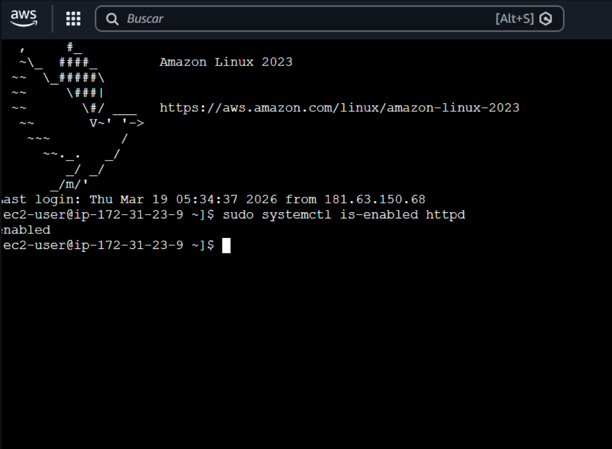
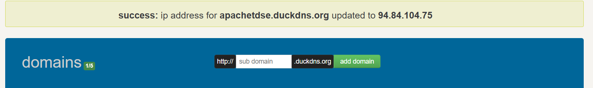
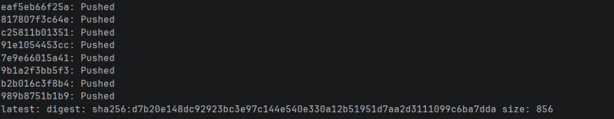
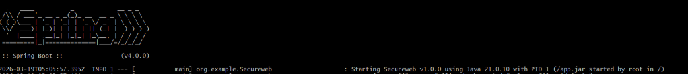
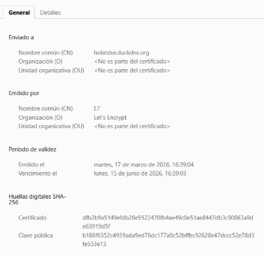
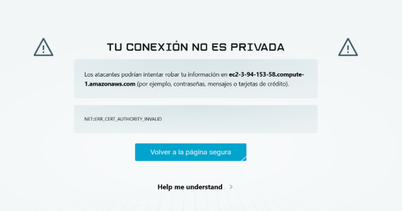

# Secure Application Design

A secure web application deployed on AWS with two independent servers: Apache serves the asynchronous HTML+JS client over HTTPS with a Let's Encrypt certificate, and Spring Boot exposes a REST API protected with TLS and Basic Auth authentication with passwords hashed using BCrypt. Spring runs in a Docker container.

---

## Architecture

**Project Structure**
```
/
lab-8
│   ├── Dockerfile                        → Spring Boot Docker Image
│   ├── pom.xml
│   └── keystores
│       ├── ecicert.cer
│       ├── myTrustStore         
│       └── ecikeystore.p12      
│   └──src/main/java/com/eci/example/
│       ├── util/
│       │   ├── User.java  
│       │   ├── UserInitializer.java  
│       │   └── UserRepository.java                      
│       ├── controllers/
│       │   ├── AuthController.java       → POST /api/register · GET /api/me
│       │   └── HelloController.java      → GET / (protected)
│       │   └── PiController.java         → GET /pi (protected)
│       └── SecurityConfig.java   
│   └── src/main/resources/
│       ├── application.properties
└── README.md
```

### Application Flow
```
User Browser
    │
    │  HTTPS port 443 — Let's Encrypt certificate
    ▼
EC2 #1 — Apache HTTP Server (directly on EC2)
Serves index.html to browser
    │
    │  HTTPS port 8443 — PKCS12 certificate (keytool)
    │  Authorization: Basic base64(username:password)
    ▼
EC2 #2 — Docker Container (Spring Boot)
Validates credentials → BCrypt → returns JSON
```

---

## Requirements

- **Java 17**
- **Maven 3.6** or higher
- **Docker**
- **AWS Account** with two EC2 instances (Amazon Linux 2023)
- **Domain** pointing to Apache EC2

Verify installation:
```bash
java -version
mvn -version
docker -v
```

---

## Local Installation and Execution

### 1. Clone the repository
```bash
git clone https://github.com/SantiagoSu15/Secure-App.git
```

### 2. Generate keystore for Spring
```bash
# Generate PKCS12 key pair
keytool -genkeypair -alias ecikeypair -keyalg RSA -keysize 2048 -storetype PKCS12 -keystore ecikeystore.p12   -validity 3650

# Export certificate
keytool -export  -keystore ./ecikeystore.p12  -alias ecikeypair -file ecicert.cer

# Import to TrustStore
keytool -import   -file ./ecicert.cer   -alias firstCA -keystore myTrustStore
```

### 3. Compile and build Docker image
```bash
cd spring-app
mvn clean package
docker build -t secure-app .
```

### 4. Start the container
```bash
docker compose up
```

The API is available at `https://localhost:8443`

---

## AWS Deployment

### Apache Server

Verify that Apache server is running


**Certificate with Let's Encrypt:**


**Supporting HTTPS with Let's Encrypt:**


**Upload HTML to server:**

Transfer index.html to the EC2 instance
```bash
sftp key instance@instance_ip

put index.html
```

Transfer file from EC2 instance to specific folder

```bash
sudo cp index.html /var/www/html/index.html
```

Configured with Duck DNS



---

### Spring Boot on Docker

#### Push image to Docker Hub

**Check local images:**
```bash
docker images
```


**Add tag for Docker Hub and push to repository:**



#### Deploy on EC2

**Run the container:**



---

### Certificate



### Test from browser



---

## Implemented Security

| Feature | Implementation |
|---|---|
| TLS on Apache | Let's Encrypt certificate via Certbot |
| TLS on Spring | PKCS12 Keystore generated with keytool |
| Authentication | HTTP Basic Auth — Spring Security |
| Password Storage | BCrypt with work factor 12 |
| CORS | Restricted to Apache domain |
| Sessions | Stateless — credentials encrypted per request |

Test users created automatically on startup:

| User | Password | Role |
|---|---|---|
| `admin` | `Admin2025!` | ROLE_ADMIN |
| `estudiante` | `Eci12345!` | ROLE_USER |

---

**SecurityConfig Class**

filterChain method

```java
@Bean
public SecurityFilterChain filterChain(HttpSecurity http) throws Exception {
    http.csrf(AbstractHttpConfigurer::disable)
            .cors(cors -> cors.configurationSource(corsConfigurationSource()))
            .sessionManagement(sm ->
                    sm.sessionCreationPolicy(SessionCreationPolicy.STATELESS))
            .authorizeHttpRequests(auth -> auth
                    .requestMatchers("/api/register").permitAll()
                    .requestMatchers("/api/**").authenticated()
                    .anyRequest().authenticated()
            )
            .httpBasic(basic -> {});

    return http.build();
}
```
* Configured with custom CORS
* Stateless session
* Access to protected endpoints is restricted with Basic Auth
* Access to `/api/register` is allowed to create users
* Basic authentication

corsConfigurationSource method
```java
    config.setAllowedOrigins(List.of("https://holatdse.duckdns.org","http://localhost:63342"));
```
* This line of code allows access to the domains `https://holatdse.duckdns.org` and `http://localhost:63342`, the first being where the Apache server is located and the second for local testing

passwordEncoder method

```java
    public PasswordEncoder passwordEncoder() {
    return new BCryptPasswordEncoder(12);
}
```
* BCrypt is used with work factor 12 to encrypt passwords

userDetailsService method

```java

@Bean
    public UserDetailsService userDetailsService() {
        return username -> {
            Optional<User> userOptional = userRepo.findByUsername(username);
            if (userOptional.isEmpty()) {
                throw new UsernameNotFoundException("User not found");
            }

            User user = userOptional.get();
            return new org.springframework.security.core.userdetails.User(user.getUsername(), user.getPassword(), List.of(new SimpleGrantedAuthority(user.getRole()))
            );
        };
    }
```
The client sends credentials in the request header `Authorization:password`

When a user logs in, Spring intercepts the request and calls this method:
* The user is searched in the database
* A UserDetails object is created with the user's data
* An org.springframework.security.core.userdetails.User object is created with the user's data
* Spring compares the sent credentials with those found in the database (the password) and compares hashes. Depending on the returned boolean, authorization is given for the endpoint

Since it's basic authentication, the user sends their credentials in each request for each protected endpoint and this process is performed to verify.

* When a user registers, their password is encrypted with BCrypt and stored in the database. If it wasn't encrypted with PasswordEncoder, the hash verification process would fail

**Index.html**
HTML + JS

```javascript
    const SPRING_BASE = 'https://localhost:8443';
    let basicHeader = null;
```
* Spring_base is the URL of the Spring server. On the Apache server, it's https:public_dns_EC2:8443
* basicHeader is the credential sent in each request to authenticate the user

```javascript
     const respuesta = await fetch(`${SPRING_BASE}/api/register`, {
    method: 'POST',
    headers: {
        'Content-Type': 'application/json',
    },
    body: JSON.stringify(datos)
    });
    console.log(respuesta);
    if (!respuesta.ok) throw new Error('Error User already exists');
```

In an asynchronous function, a POST request is made to `/api/register` with the form data (username, password). Only the body with the form data is sent since credentials are not required.

```javascript
    const contraCodificada = btoa(`${usuario}:${contra}`);
    basicHeader = `Basic ${contraCodificada}`;

    try {
         const respuesta = await fetch(`${SPRING_BASE}/api/me`, {
                method: 'GET',
                headers: { 'Authorization': basicHeader }
            });
         if (!respuesta.ok) throw new Error('Invalid username or password');
```
In another asynchronous function, a GET request is made to `/api/me` with the credential in the `Authorization` header:
* Spring intercepts the request, performs the entire previous process, and creates an Authentication object that it injects into the endpoint
* The user is searched in the database
* If the user exists, a JSON with the username is returned

The credential is saved in the browser and sent in each request to authenticate the user. This is not the safest approach since the password is stored in the browser and sent in each request despite using HTTPS. If someone intercepts the connection without SSL, credentials could be stolen.

```javascript

    const res = await fetch(`${SPRING_BASE}/pi`, {
        method: 'GET',
        headers: { 'Authorization': basicHeader }
    });

    const res = await fetch(`${SPRING_BASE}/`, {
        method: 'GET',
        headers: { 'Authorization': basicHeader }
    });
```
* For other endpoints, the credential is sent in the `Authorization` header

---

## Built with

- **Java 17** — Main language
- **Spring Boot 3.2** — Backend framework
- **Spring Security** — Authentication and BCrypt
- **Apache httpd** — Web server for client
- **Let's Encrypt / Certbot** — TLS for Apache
- **Java keytool** — PKCS12 Keystore for Spring
- **Docker** — Spring Boot container
- **Docker Hub** — Image registry
- **AWS EC2** — Cloud infrastructure

---

## Author

juan felipe rangel rodriguez
